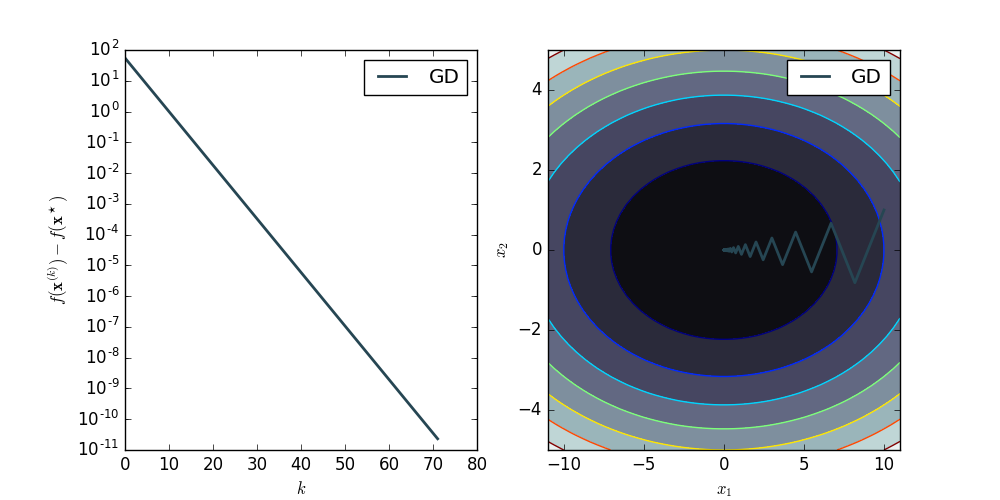
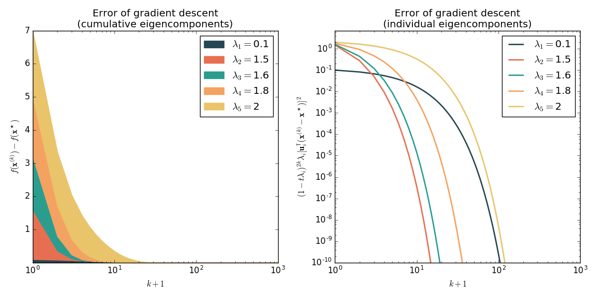
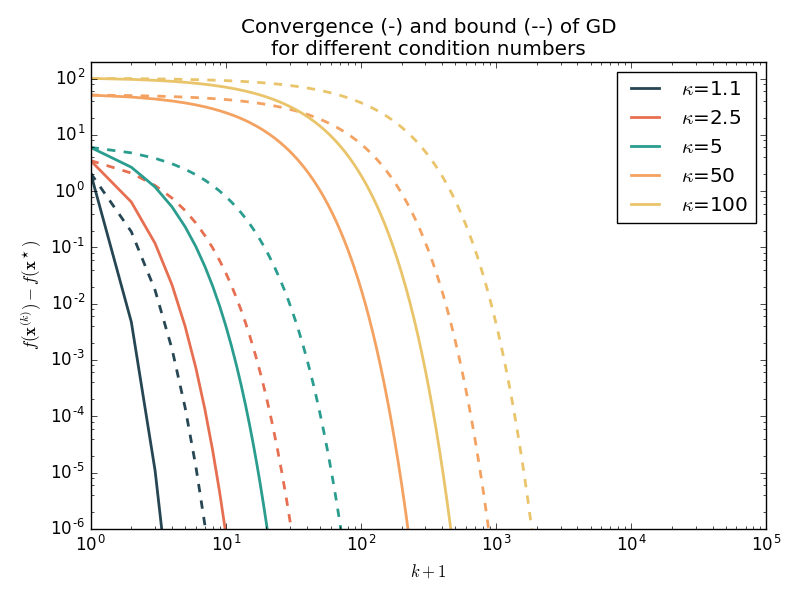
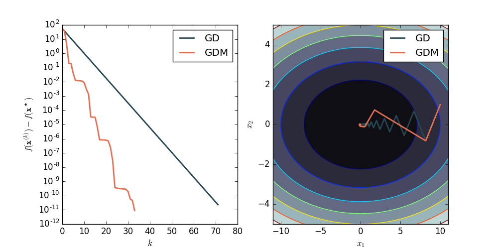

# Quadratic optimization

## Motivation

Quadratic systems are important:
- Systems close to their maximum can closely be approximated by a quadratic system, studying the minimization of quadratic systems can teach us about minimization of general convex functions.
- Quadratic systems are important in their own right! Many statistical models, graph problems, molecular models etc. can be formulated as quadratic systems!

## Warming up: one-dimensional quadratic systems

In the the scalar case, a quadratic function is given by
$$
f(x) = \frac{1}{2}px^2+qx +r\,,
$$
with $p>0$ (as we will see).

Our optimization problem is given by:
$$
\min_x\,\frac{1}{2}px^2+qx +r\,.
$$

This can easily be solved by setting the first order derivative equal to zero:

$$
\frac{\mathrm{d}f(x)}{\mathrm{d}x} = px + q \\
px^\star+q = 0 \Leftrightarrow x^\star=\frac{-q}{p}
$$
To show that this is the sole minimizer of $f(x)$, we have to prove that the second order derivative is positive in this point. This means that at that point the derivative of the function is increasing: a little to the left the function is increasing and a little to the right and the function is decreasing. We have
$$
\left.\frac{\mathrm{d}^2f(x)}{\mathrm{d}x^2}\right|_{x^\star} = p\,,
$$
so if $p>0$ then $x^\star$ is the minimizer of $f(x)$.

> coding exercise

## Towards $n$-dimensional quadratic systems

Let directly move from the one-dimensional case to the $n$-dimensional case. We will use vector notation
$$
\mathbf{x} = \begin{bmatrix}
       x_1 \\ \vdots \\ x_n
     \end{bmatrix} \in \mathbb{R}^n\,.
$$
A general $n$-dimensional linear system is given by:
$$
f(\mathbf{x}) = \mathbf{x}^\intercal P \mathbf{x} + \mathbf{q}^\intercal\mathbf{x} + r\,,
$$
with $P$ an $n\times n$ symmetric matrix, $\mathbf{q}$ an $n$-dimensional vector and $r$ a scalar.

> Why is $P$ symmetric?

So we want to solve the problem:
$$
\min_\mathbf{x}\,\mathbf{x}^\intercal P \mathbf{x} + \mathbf{q}^\intercal\mathbf{x} + r\,.
$$

The concept of a derivative is extended towards higher dimensions using the *gradient* operator:
$$
\nabla_\mathbf{x} = \begin{bmatrix}
       \frac{\partial \, }{\partial x_1} \\ \vdots \\ \frac{\partial \, }{\partial x_n}
     \end{bmatrix}\,,
$$
so that the gradient of $f(\mathbf{x})$ is given by:
$$
\nabla_\mathbf{x} f(\mathbf{x}) = \begin{bmatrix}
       \frac{\partial f{x}f(\mathbf{x}) }{\partial x_1} \\ \vdots \\ \frac{\partial f{x}f(\mathbf{x}) }{\partial x_n}
     \end{bmatrix}\,.
$$
From now on, we will drop the subscript in the gradient, unless it is not clear from context how the gradient is computed. For those not familiar to vector calculus, the most useful rules are given below.

| rule | example     |
| :------------- | :------------- |
| linearity      | $\nabla(a f(\mathbf{x}) +b g(\mathbf{x})) = a\nabla f(\mathbf{x}) +b\nabla g(\mathbf{x})$       |
| product rule | $\nabla(f(\mathbf{x}) g(\mathbf{x})) = g(\mathbf{x})\nabla f(\mathbf{x}) + f(\mathbf{x})\nabla g(\mathbf{x})$|
|chain rule|$\nabla f(g(\mathbf{x})) = \left.\frac{\partial f}{\partial g}\right|_\mathbf{x}\nabla f(\mathbf{x})$|
| quadratic term | $\nabla (\frac{1}{2}\mathbf{x}^\intercal A\mathbf{x})= A\mathbf{x}$|
|linear term| $\nabla (\mathbf{b}^\intercal\mathbf{x})=\mathbf{b}$|
|constant term |$\nabla c = 0$ |

The gradient of the quadratic function is
$$
\nabla f(\mathbf{x})=P\mathbf{x} +\mathbf{q}\,.
$$
Setting this to zero gives
$$
\mathbf{x}^\star=-P^{-1}\mathbf{q}\,.
$$
How do we know that $\mathbf{x}^\star$ is the minimizer of the quadratic system? For this we have to extend the concept of a second order derivative to $n$ dimensions. We define the *Hessian* as:
$$
\nabla^2 f(\mathbf{x}) = \begin{bmatrix}
\frac{\partial^2 f(\mathbf{x})}{\partial {x_{1}}^2} & \frac{\partial^2 f(\mathbf{x})}{\partial x_1 x_2} & \ldots &  \frac{\partial^2 f(\mathbf{x})}{\partial x_1 x_n}\\
\frac{\partial^2 f(\mathbf{x})}{\partial x_1 x_2} & \frac{\partial^2 f(\mathbf{x})}{\partial {x_2}^2} & \ldots & \vdots \\
\vdots & \vdots & \ddots & \vdots \\
\frac{\partial^2 f(\mathbf{x})}{\partial x_1 x_n} & \frac{\partial^2 f(\mathbf{x})}{\partial x_2 x_n} & \ldots & \frac{\partial^2 f(\mathbf{x})}{\partial x_n^2}
\end{bmatrix}\,.
$$
For the quadratic system, this boils down to
$$
\nabla^2 f(\mathbf{x}) = P\,.
$$
The condition for $\mathbf{x}^\star$ to be the minimizer of $f(\mathbf{x})$ is that the Hessian should be *positive-definite* in that point.

> A symmetric $n\times n$ matrix $A$ is positive-definite (in symbols: $A\succ0$), if for any vector $\mathbf{z}\in\mathbb{R}^n$
> $$
> \mathbf{z}^\intercal A \mathbf{z} > 0\,.
> $$

A matrix is positive-definite if (and only if) all its eigenvalues as positive.

A point $\mathbf{x}^\star$ at which the gradient vanishes is a minimizer if and only if
$$
\nabla^2 f(\mathbf{x})|_{\mathbf{x}^\star} \succ 0\,.
$$
So, for the quadratic problem, $x\star$ is the unique minimizer iff $P\succ 0$. This means that along every direction $\mathbf{v}\in \mathbb{R}^n$ to project $\mathbf{x}$, the problem reduces to a one-dimensional quadratic function with a positive second-order constant:
$$
x_v = \mathbf{v}^\intercal \mathbf{x}\\
f'(x_v) = x_v (\mathbf{v}^\intercal P \mathbf{v}) x_v + (\mathbf{v}^\intercal \mathbf{q})x_v + r\,,
$$
where $\mathbf{v}^\intercal P \mathbf{v}>0$ if $P\succ 0$, which in turn implies that $f'(x_v)$ has a minimizer.

If $P\succ 0$, the quadratic system is a *convect* function with a single minimizer. In many problems, $P$ is positive-definite, so there is a well-defined solution. We will develop this further in Chapter 2.

> Consider $L_2$ regularized ridge regression:
> $$
> \min_\mathbf{x}\, (\mathbf{y} - B\mathbf{x})^\intercal(\mathbf{y} - B\mathbf{x}) + c \mathbf{x}^\intercal\mathbf{x}\,,
> $$
> with $c>0$. Write this in the standard form of a quadratic system and show that it is convex. Give the expression for the minimizer.

## Time and memory complexity of exact solution

The exact solution for convex quadratic system hinges on solving a $n\times n$ linear system. Conventional solvers for linear systems have a time complexity of $\mathcal{O}(n^3)$. This is doable for problems of moderate size ($n<1000$), but becomes infeasible for large-scale problems.

> plot of time complexity

Storing an $n\times n$ matrix also has a memory requirement of $\mathcal{O}(n^2)$. When $n$ is too large, this cannot fit in main memory. In the remainder of this chapter, we will consider the case when $P$ is too large to work with, while matrix-vector products $P\mathbf{x}$ can be computed. Some examples of when such settings occur:
- $P=B^\intercal B$, with $B\in \mathbb{R}^{n\times p}$, with $p\ll n$.
- $P$ is a very sparse matrix.
- $P$ has a special structure so that $P\mathbf{x}$ can be computed on the fly, e.g. $P_{ij}=i^2j^3$.
- $P$ is loaded an processed as different blocks.

## Descent methods

Instead of computing the solution of a convex quadratic system in one step, we will use *descent methods*. Here, a minimizing sequence $\mathbf{x}^{(k)},\, k=1,\dots$, where
$$
\mathbf{x}^{(k+1)} = \mathbf{x}^{(k)} +t^{(k)}\Delta \mathbf{x}^{(k)}\,,
$$
with $t^{(k)}\geq 0$ called the *step size* (in machine learning often called *learning rate*)and $\Delta \mathbf{x}^{(k)}$ called the *search direction*. Proper descent methods have that
$$
f(\mathbf{x}^{(k+1)}) < f(\mathbf{x}^{(k)})\,,
$$
except when $\mathbf{x}^{(k)}$ is optimal. In this property to hold, the search direction should satisfy
$$
(\Delta \mathbf{x}^{(k)})^\intercal \nabla f(\mathbf{x}) < 0\,.
$$

> figure!

### General descent algorithm

Below is the general pseudocode of a general descent method:

> **given** a starting point $\mathbf{x}$
>
> **repeat**
>> 1. Determine descent direction $\Delta \mathbf{x}$
>> 2. *Line search*. Choose $t>0$.
>> 3. *Update*. $\mathbf{x}:=\mathbf{x} + t \Delta \mathbf{x}$.
>
> **until** stopping criterion is reached.

Usually, the convergence criterion is of the form
$$
||\nabla f(\mathbf{x})|| < \nu\,.
$$

The step size can be chosen in several ways:
- **exact**: $t=\arg\min_{s\geq 0}\, f(\mathbf{x}+s\Delta \mathbf{x})$.
- **approximate**: choose a $t$ that only approximately minimizes $f(\mathbf{x}+s\Delta \mathbf{x})$.
- **decaying**: choose some decaying series, e.g. $t = \frac{1}{\alpha+k}$.
- **constant**: a constant step size (often done in practice).

For quadratic systems we can compute the exact step size, as this amounts to a simple one-dimensional quadratic problem:
$$
t=\arg\min_{s\geq 0}\, \frac{1}{2}(\mathbf{x}+s\Delta \mathbf{x})^\intercal P (\mathbf{x}+s\Delta \mathbf{x}) + (\mathbf{x}+s\Delta \mathbf{x}) \mathbf{q} + r
$$
$$
t = \frac{-(\Delta\mathbf{x})^\intercal P \mathbf{x}-(\Delta\mathbf{x})^\intercal\mathbf{q}}{(\Delta\mathbf{x})^\intercal P \Delta\mathbf{x}}
$$

> implement exact line search

## Gradient descent

A natural choice for the search direction is the negative gradient:
$$
\Delta \mathbf{x} = - \nabla f(\mathbf{x})\,.
$$
Remember, for the quadratic system, the gradient was $\nabla f(\mathbf{x})=P\mathbf{x} + \mathbf{q}$, so
$$
\Delta \mathbf{x} = - P\mathbf{x} - \mathbf{q}\,.
$$

### Gradient descent algorithm for quadratic systems

> **given** a starting point $\mathbf{x}$
>
> **repeat**
>> 1. $\Delta \mathbf{x} := - P\mathbf{x} - \mathbf{q}$
>> 2. *Line search*. Choose optimal $t>0$.
>> 3. *Update*. $\mathbf{x}:=\mathbf{x} + t \Delta \mathbf{x}$.
>
> **until** stopping criterion is reached.

### Illustration

We illustrate the gradient descent algorithm for the following system:
$$
\min_\mathbf{x}\, \frac{1}{2} (x_1^2 + \gamma x_2^2)\,
$$
with $\gamma$ set to 10.

### Convergence analysis

We can study the convergence of the gradient descent algorithm by using eigenvalue decomposition. The matrix $P$ can be written as:
$$
P = U\Lambda U^\intercal\,,
$$
with
- $\Lambda=\text{diag}(\lambda_1,\ldots,\lambda_n)$, a matrix with the eigenvalues on the diagonal (sorted from small to large).
- $U = [\mathbf{u}_1, \ldots, \mathbf{u}_n]$, a matrix with the corresponding eigenvectors.

Note that because $P\succ 0$, all eigenvalues are real and positive and all eigenvectors form a real orthonormal basis.

Consider the following linear transformation:
$$
\mathbf{z}^{(k)}= U^\intercal ( \mathbf{x}^{\star}-\mathbf{x}^{(k)})\,,
$$
which allows us to rewrite the error in closed-form:
$$
f(\mathbf{x}^{(k)}) - f(\mathbf{x}^\star) = \frac{1}{2}\sum_{i=1}^n (1-t\lambda_i)^{2k}\lambda_i[(\mathbf{U}_i)^\intercal(\mathbf{x}^{(0)}-\mathbf{x}^\star)]^2\,.
$$
Here, we see that:
1. The error decomposes in independent terms in the eigenspace.
2. The convergence of each term is determined by the *rate*: $|1-t\lambda_i|$. Convergence occurs as a geometric series.
3. The total convergence is determined by either the smallest or largest eigenvalue.
4. Optimal value for fixed step size is $t=\frac{1}{\lambda_1+\lambda_n}$.

Furthermore, it can be shown that if we use an exact linesearch for the step size, the error $f(\mathbf{x}^{(k)}) - f(\mathbf{x}^\star)\leq \epsilon$ we need fewer than
$$
\frac{\log((f(\mathbf{x}^{(k)}) - f(\mathbf{x}^\star))/\epsilon)}{\log(1/c)}\,,
$$
with $c=1-\frac{\lambda_1}{\lambda_n}<1$. The quantity $\kappa=\frac{\lambda_n}{\lambda_1}$ is called the *condition number* and largely determines the convergence. We observe:
- The quality of the initial guess ($f(\mathbf{x}^{(k)}) - f(\mathbf{x}^\star$) has only a logarithmic impact on the number of steps required.
- Only a few extra steps are needed to decrease $\epsilon$ with one order or magnitute.
- If the condition number is large, then $\log(1/c)\approx 1/\kappa$. Large condition numbers require more steps.

## Gradient descent with momentum

> *While finding the gradient of an objective function is a splendid idea, [descending] the gradient directly may not be.* ~ David J.C. MacKay

Even on simple quadratic problems as discussed here, gradient descent often takes a surprisingly large number of steps to converge. This is because the gradient does not necessarily points in the general direction of the minimum. For convex problems, we are only guaranteed that the gradient points in the half-space of the minimum - a rather weak guarantee! Many improvements on gradient descent have been devised. We will briefly discuss a small modification which can lead to a very large improvement in performance.

### Steps with memory

$$
\Delta \mathbf{x}^{(k+1)} = \beta \Delta \mathbf{x}^{(k)} - \alpha\nabla f(\mathbf{x}^{(k)})\\
\mathbf{x}^{(k+1)} = \mathbf{x}^{(k)} + t^{(k)}\Delta \mathbf{x}^{(k+1)}\,,
$$
with $\alpha,\beta\in[0,1]$.

Connection to machine learning...

### Gradient descent algorithm with momentum

> **given** a starting point $\mathbf{x}$, $\alpha$, $\beta$
>
> **initialize** $\Delta \mathbf{x}= \mathbf{0}$
>
> **repeat**
>> 1. $\Delta \mathbf{x} := \beta \Delta \mathbf{x}- \alpha\nabla f(\mathbf{x})$
>> 2. *Line search*. Choose optimal $t>0$.
>> 3. *Update*. $\mathbf{x}:=\mathbf{x} + t \Delta \mathbf{x}$.
>
> **until** stopping criterion is reached.

> implementation

### Illustration

## Conjugated gradient descent

Might add something here, remove in time constraint

## Exercise: signal recovery

As a practical example of minimizing quadratic systems, let us consider a simple signal recovery problem. Consider an $n$-dimensional real vector $\mathbf{x}=[x_1,\ldots,x_n]^\intercal$. Rather than observing this vector directly, we have $m$ noisy measurements at random indices (indices drawn randomly with replacement from $\{1,\ldots,n\}$): $\mathcal{O} = \{(i_j, y_j)\mid j=1,\ldots,m\}$. These measurements are stored in an $m$-dimensional vector $\mathbf{y}$. Can we recover $\mathbf{x}$ from $\mathbf{y}$?

If $m<n$, then we do not have a single measurement for every element of $\mathbf{x}$. Even if $m>n$, it is likely that some elements of $\mathbf{x}$ are not observed due to chance (for large $n$, if $n=m$ then about 37% of the elements will not be sampled). Clearly, recovering $\mathbf{x}$ from $\mathbf{y}$ is an impossible assumption if we do not make some assumptions, this seems an impossible problem in general.

If we assume that the different values of $\mathbf{x}$ are on a line, then we can make a *smoothness* assumption: elements of $\mathbf{x}$ for which the indices are close, likely will have similar values. This idea is expressed in the follow minimization problem:
$$
\min_\mathbf{x}\, \frac{1}{2}\sum_{j=1}^m(y_j-{x}_{i_j})^2 + \frac{C}{2} \mathbf{x}^\intercal K^{-1}\mathbf{x}\,,
$$
with $K^{-1}$ an inverse kernel (or covariance matrix) and $C$ a tuning hyperparameter. The matrix $K^{-1}$ encodes how the different elements of $\mathbf{x}$ are related, constructing such a matrix is a topic in machine learning (see course Predictive Modelling). For our purposes, we have chosen this matrix as such that elements should have values closes to each other. Hence, the minimization problem has two terms:
- a data fitting term to make sure that the recovered vector $\mathbf{x}$ matches the observations,
- a regularization term to ensure smoothness of the solution.
The parameter $C$ determines the trade-off between the two terms.

The problem can written purely in matrix notation by using the $(m\times n)$ bookkeeping matrix $R$, which contains for every row UITWERKEN
$$
\min_\mathbf{x}\, \frac{1}{2}(\mathbf{y}-R\mathbf{x})^\intercal(\mathbf{y}-R\mathbf{x}) + \frac{C}{2} \mathbf{x}^\intercal K^{-1}\mathbf{x}\,,
$$

**assignments**
1. Write the minimization problem in the standard form.
2. Use the function `generate_noisy_measurements` to generate $m=100$ noisy measurements (standard deviation is 1, default) of a vector with dimensionality $n=1000$. Use the functions `make_connection_matrix` and `make_bookkeeping` to generate the associated $K^{-1}$ and $L$.
3. Use $C=1$, generate $\mathbf{x}^\star$ using the closed-form solution, using gradient descent and gradient descent with momentum. How many steps do the two descent methods need to converge?
4. Solve the system for values of $C=1\times 10^{-3}, 1\times 10^{-2}, \ldots,1\times 10^{2},1\times 10^{3}$. Make three different plots:
    - The different $\mathbf{x}^\star$ visualized for different values of $C$.
    - The convergence $f(\mathbf{x}^{(k)})-f(\mathbf{x}^\star)$ using gradient descent for different values of $C$.
    - The convergence $f(\mathbf{x}^{(k)})-f(\mathbf{x}^\star)$ using gradient descent with momentum for different values of $C$.

## References

- Boyd, S. and Vandenberghe, L. '*[Convex Optimization](https://web.stanford.edu/~boyd/cvxbook/bv_cvxbook.pdf))*'. Cambridge University Press (2004)
- Goh, G. '[*Why Momentum really works*](https://distill.pub/2017/momentum/)' (2017)
