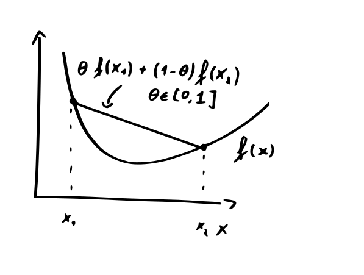
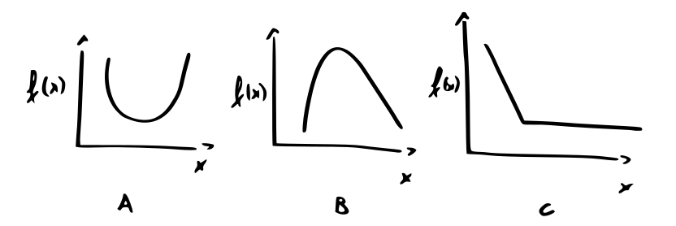
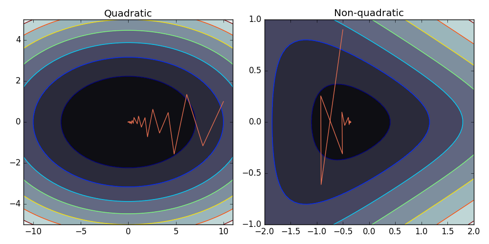
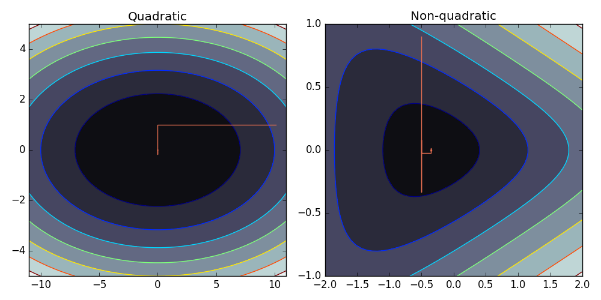

# Unconstrained convex optimization

## Motivation

In this chapter we will study unconstrained convex problems, i.e. problems of the form
$$
\min_\mathbf{x}\, f(\mathbf{x})\,,
$$
in which $f$ is convex. Convex optimization problems are well understood. Their most attractive property is that when a minimizer exists, the minimizer is the unique global minimizer.

Most convex optimization problems do not have a closed-from solution, with the quadratic problems of the previous chapters as a notable exception. We will hence again have to resort to descent methods to find an (arbitrary accurate) approximate solution.

## Convex sets and functions

### Convex set

> **In words**: a set $\mathcal{C}$ is called **convex** if the line segment between any two points in $\mathcal{C}$ also lies in $\mathcal{C}$.

> **In symbols**:  a set $\mathcal{C}$ is called **convex** if, for any $x, x' \in \mathcal{C}$ and any $\theta \in [0, 1]$, it holds that
> $$
> \theta x + (1 − \theta)x' \in \mathcal{C}\,.
> $$


### Convex functions

> **In words**:  a function $f$ is **convex** if the line segment between $(\mathbf{x}, f(\mathbf{x}))$ and $(\mathbf{x}', f (\mathbf{x}'))$ lies above the graph of $f$.

> **In symbols**: In symbols: a function $f : \mathbb{R}^n\rightarrow \mathbb{R}$ is convex if
> - dom($f$) is convex
> - for any $\mathbf{x}, \mathbf{x}' \in \text{dom}(f)$ and any $\theta \in [0, 1]$, it holds that
> $$
> f(\theta \mathbf{x} + (1-\theta)\mathbf{x}') \leq\theta f(\mathbf{x}) +(1-\theta)f(\mathbf{x}')\,.
> $$





From the definition, it follows that:
- If the function is differentiable, then $f(\mathbf{x})\geq f(\mathbf{x}')+\nabla f(\mathbf{x}')(\mathbf{x}-\mathbf{x}')$ for all $\mathbf{x}$ and $\mathbf{x}' \in \text{dom}(f)$.
- If the function is twice differentiable, then $\nabla^2 f(\mathbf{x})\succeq 0$ for any $\mathbf{x}\in\text{dom}(f)$.

Figure!  #TODO

Convex functions frequently arise:
- If $f$ and $g$ are both convex, then $m(x)=\max(f(x), g(x))$ and $h(x)=f(x)+g(x)$ are also convex.
- If $f$ and $g$ are convex functions and $g$ is non-decreasing over a univariate domain, then $h(x)=g(f(x))$ is convex. Example: $e^{f(x)}$ is convex if $f(\mathbf{x})$ is convex.

Note, the convexity of expected value in probability theory gives rise to **Jensen's inequality**. For any convex function $\varphi$, if holds that
$$
\varphi(\mathbb{E}[X]) \leq\mathbb{E}[\varphi(X)]\,.
$$

This implies for example that the square of an expected value of quantity is never greater than the expected square of that quantity.

### Strongly convex functions

> **In words**: a function $f$ is called **strongly convex** if it is at least as convex as a quadratic function

> **In symbols**: $f$ is called *strongly $m$-convex* (with $m>0$) if the function
> $$
> f_m(\mathbf{x}) = f(\mathbf{x}) - \frac{m}{2}||\mathbf{x}||_2
> $$
> is convex.

If the first- and second order derivatives exists, an strongly $m$-convex satisfies:
- $f(\mathbf{x}') \geq f(\mathbf{x}) + \nabla f(\mathbf{x})^\intercal (\mathbf{x}'-\mathbf{x}) + \frac{m}{2}||\mathbf{x}'-\mathbf{x}||_2$
- $\nabla^2 f(\mathbf{x})-mI\succeq 0$

If a function is $m$-strongly convex, this also implies that there exists an $M>m$ such that
$$
\nabla^2 f(\mathbf{x}) \preceq MI\,.
$$
TODO: check!

## Minimizing convex functions

## Toy examples

To illustrate the algorithms, we introduce two toy functions to minimize:

* Simple quadratic problem:

$$
f(x_1, x_2) = \frac{1}{2} (x_1^2 +\gamma x_2^2)\,,
$$
where $\gamma$ determines the condition number.

* A non-quadratic function:
$$
f(x_1, x_2) = \log(e^{x_1 +3x_2-0.1}+e^{x_1 -3x_2-0.1}+e^{-x_1 -0.1})\,.
$$

## Backtracking line search

Convex functions are usually minimized using descent methods. Again, line search is often used as a subroutine.

The outline of a general descent algorithm is given in the following pseudocode.

> **input** starting point $\mathbf{x}\in$ **dom** $f$.
>
> **repeat**
>
>>    1. Determine a descent direction $\Delta \mathbf{x}$.
>>    2. *Line seach*. Choose a step size $t>0$.
>>    3. *Update*. $\mathbf{x}:=\mathbf{x}+t\Delta \mathbf{x}$.
>
> **until** stopping criterion is satisfied.
>
> **output** $\mathbf{x}$


The specific optimization algorithms are hence determined by:
- method for determining the step size $\Delta x$, this is usually based on the gradient of $f$
- method for choosing the step size $t$, may be fixed or adaptive
- the criterion used for terminating the descent, usually the algorthm stops when the improvement is smaller than a predefined value

### Exact line search

As a subroutine of the general descent algorithm a line search has to be performend. A $t$ is chosen to minimize $f$ along the ray $\{x+t\Delta x \mid t\geq0\}$:

$$
t = \text{arg min}_{s\geq0}\ f(x+t\Delta x)\,.
$$

Exact line search is used when the cost of solving the above minimization problem is small compared to the cost of calculating the search direction itself. This is sometimes the case when an analytical solution is available.

### Inexact line search

Often, the descent methods work well when the line search is done only approximately. This is because the computational resourches are better spend to performing more *approximate* steps in the differnt directions because the direction of descent will change anyway.

Many methods exist for this, we will consider the *backtracking line search* (BTLS), described by the following pseudocode.

> **input** starting point $x\in$ **dom** $f$, descent direction $\Delta x$, $\alpha\in(0,0.05)$ and $\beta\in(0,1)$.
>
> $t:=1$
>
>**while** $f(x+t\Delta x) > f(x) +\alpha t \nabla f(x)^\intercal\Delta x$
>
>>    $t:=\beta t$
>
>
>**output** $t$


**Assignment 1**
1. Complete the code for the backtracking line search
2. Use this function find the step size $t$ to (approximately) minimize $f(x) = x^2 - 2x - 5$ starting from the point $0$. Choose a $\Delta x=10$.

```python
def backtracking_line_search(f, x0, Dx, grad_f, alpha=0.1, beta=0.7):
    '''
    Uses backtracking for finding the minimum over a line.
    Inputs:
        - f: function to be searched over a line
        - x0: initial point
        - Dx: direction to search
        - grad_f: gradient of f
        - alpha
        - beta
    Output:
        - t: suggested stepsize
    '''
    # ...
    while # ...
        # ...
    return t
```

```python
function = lambda x : x**2 - 2*x - 5
gradient_function = lambda x : 2*x -2
backtracking_line_search(function, 0, 10, gradient_function)
```

## Gradient descent

A natural choise for the search direction is the negative gradient: $\Delta x = -\nabla f(\mathbf{x})$. This algorithm is called the *gradient descent algorithm*.

### General gradient descent algorithm

>**input** starting point $x\in$ **dom** $f$.
>
>**repeat**
>
>>    1. $\Delta \mathbf{x} := -\nabla f(\mathbf{x})$.
>>    2. *Line seach*. Choose a step size $t$ via exact or backtracking line search.
>>    3. *Update*. $\mathbf{x}:=\mathbf{x}+t\Delta \mathbf{x}$.
>
>**until** stopping criterion is satisfied.
>
>**output** $\mathbf{x}$

The stopping criterion is usually of the form $||\nabla f(x)||_2 \leq \nu$.

### Convergence analysis

The notion of strongly convexity alows us to bound the function $f$ by two quadratic functions. As such we can reuse the convergence analysis of the previous chapter.

If $f$ is strongly convex (constants $m$ and $M$ exist), it holds that $f(\mathbf{x}^{(k)}) - p^*\leq \varepsilon$ after at most
$$
\frac{\log((f(\mathbf{x}^{(0)}) - p^*)/\varepsilon)}{\log(1/c)}
$$
iterations, where $c =1-\frac{m}{M}<1$.

We conclude:
- Number of steps needed for a given quality is proportional to the logarithm of the initial error.
- To increase the accuracy with an order of magnitude, only a few more steps are needed.
- Convergence is again determined by the *condition number* $m/M$. Note that for large condition numbers: $\log(1/c)=-\log(1-\frac{m}{M})\approx m/M$, so the number of required iterations increases linearly with increasing $m/M$.

### Illustration

**Assignment 2**
1. Complete the implementation of the gradient descent method.
2. Plot the paths for the two toy problems.
3. Analyze the convergence.

```python
def gradient_descent(f, x0, grad_f, alpha=0.2, beta=0.7,
      nu=1e-3, trace=False):
    '''
    General gradient descent algorithm.
    Inputs:
        - f: function to be minimized
        - x0: starting point
        - grad_f: gradient of the function to be minimized
        - alpha: parameter for btls
        - beta: parameter for btls
        - nu: parameter to determine if the algorithm is converged
        - trace: (bool) store the path that is followed?
    Outputs:
        - xstar: the found minimum
        - x_steps: path in the domain that is followed (if trace=True)
        - f_steps: image of x_steps (if trace=True)
    '''
    x = x0  # initial value
    if trace: x_steps = [x0.copy()]
    if trace: f_steps = [f(x0)]
    while True:
        # ...  # choose direction
        if # ...
            break  # converged
        # ...
        if trace: x_steps.append(x.copy())
        if trace: f_steps.append(f(x))
    if trace: return x, x_steps, f_steps
    else: return x
```



## Steepest descent

Optimize the first-order Taylor approximation of a function:

$$
f(\mathbf{x}+\mathbf{v}) \approx \hat{f}(\mathbf{x}+\mathbf{v}) =f(\mathbf{x}) +\nabla f(\mathbf{x})^\top \mathbf{v}\,.
$$

The linear approximation $\hat{f}$ can be made arbitrary negative if we can freely choose $\mathbf{v}$! We have to contrain the *norm* of $\mathbf{v}$.

### Vector norms

A norm on $\mathbb{R}^n$ is a function $||\cdot||:\mathbb{R}^n\rightarrow \mathbb{R}$ with the following properties:
- $||\mathbf{x}||>0$, for any $\mathbf{x}\in\mathbb{R}$
- $||\mathbf{x}+\mathbf{y}|| \leq ||\mathbf{x}||+||\mathbf{y}||$, for any $\mathbf{x}, \mathbf{y}\in\mathbb{R}$
- $||\lambda \mathbf{x}|| = |\lambda|\, ||\mathbf{x}||$ for any $\lambda \in\mathbb{R}$ and any $\mathbf{x}\in\mathbb{R}$
- $||\mathbf{x}||=0$ if and only if $\mathbf{x}=0$

For example, for any $p\in\mathbb{R}$ and $p\leq 1$:
$$
||\mathbf{x}||_p = \left(\sum_{i=1}^n |x_i|^p\right)^\frac{1}{2}\,.
$$

Consider $P\in \mathbb{R}^{n\times n}$ such that $P\succ 0$. The  corresponding *quadratic norm*:
$$
||\mathbf{z}||_P = (\mathbf{z}^\intercal P\mathbf{z})^\frac{1}{2}=||P^\frac{1}{2}\mathbf{z}||_2\,.
$$
The matrix $P$ can be used to encode prior knowledge about the scales and dependencies in the space that we want to search.

### Dual norm

Let $|| \cdot ||$ be a norm on $\mathbb{R}^n$. The associated dual norm:
$$
||\mathbf{z}||_*=\sup \{\mathbf{z}^\intercal\mathbf{x}\mid ||\mathbf{x}||\leq 0\}\,.
$$

Examples:
- The dual norm of $||\cdot||_1$ is $||\cdot||_\infty$
- The dual norm of $||\cdot||_2$ is $||\cdot||_2$
- The dual norm of $||\cdot||_P$ is defined by $||\mathbf{z}||_*=||P^{-\frac{1}{2}}\mathbf{z}||$

### Steepest descent directions

**Normalized steepest descent direction**:

$$
\Delta x_\text{nsd} = \text{arg min} \{\nabla f(x)^T \mathbf{v} \mid ||\mathbf{v}||\leq 1 \}\,.
$$

**Unnormalized steepest descent direction**:

$$
\Delta x_\text{sd} = ||\nabla f(\mathbf{x})||_\star \Delta x_\text{nsd} \,.
$$

Note that we have
$$
\nabla f(\mathbf{x})^\intercal \Delta x_\text{sd} = ||\nabla f(\mathbf{x})||_\star \nabla f(\mathbf{x})^\intercal\Delta x_\text{nsd} = -||\nabla f(\mathbf{x})||^2_\star\,,
$$
so this is a valid descent method.

### Coordinate descent algorithm

Using the $L_1$ norm results in coordinate descent.

>**input** starting point $\mathbf{x}\in$ **dom** $f$.
>
>**repeat**
>
>>    1. *Direction*. Choose $i$ such that $|\nabla f(\mathbf{x})_i|$ is maximal.
>>    2. *Choose direction*. $\Delta \mathbf{x} := -\nabla f(\mathbf{x})_i e_i$
>>    3. *Line seach*. Choose a step size $t$ via exact or backtracking line search.
>>    4. *Update*. $\mathbf{x}:=\mathbf{x}+t\Delta \mathbf{x}$.
>
>**until** stopping criterion is satisfied.
>
>**output** $\mathbf{x}$

Here, $e_i$ is the $i$-th basic vector.

The stopping criterion is usually of the form $||\nabla f(\mathbf{x})||_2 \leq \nu$.



**Assignment 3**
1. Complete the implementation of the coordinate descent method.
2. Plot the paths for the two toy problems.
3. Analyze the convergence.

```python
def coordinate_descent(f, x0, grad_f, alpha=0.2, beta=0.7, nu=1e-3, trace=False):
    '''
    General coordinate descent algorithm.
    Inputs:
        - f: function to be minimized
        - x0: starting point
        - grad_f: gradient of the function to be minimized
        - alpha: parameter for btls
        - beta: parameter for btls
        - nu: parameter to determine if the algorithm is converged
        - trace: (bool) store the path that is followed?
    Outputs:
        - xstar: the found minimum
        - x_steps: path in the domain that is followed (if trace=True)
        - f_steps: image of x_steps (if trace=True)
    '''
    x = x0  # initial value
    n, _ = x.shape
    if trace: x_steps = [x0.copy()]
    if trace: f_steps = [f(x0)]
    while True:
        ...  # choose direction
        if # check if converged
            break  # converged
        ... # BLS for optimal step size
        ... # do a step
        if trace: x_steps.append(x.copy())
        if trace: f_steps.append(f(x))
    if trace: return x, x_steps, f_steps
    else: return x
```

Example figures

## Newton's method

### The Newton step

In Newton's method the descent direction is chosen as

$$
\Delta \mathbf{x}_\text{nt} = -(\nabla^2f(\mathbf{x}))^{-1} \nabla f(\mathbf{x})\,,
$$
which is called the *Newton step*.

If $f$ is convex, then $\nabla^2f(\mathbf{x})$ is positive definite and
$$
\nabla f(\mathbf{x})^\intercal \Delta \mathbf{\mathbf{x}}_\text{nt} \geq 0\,,
$$
hence the Newton step is a descent direction unless $\mathbf{x}$ is optimal.

This Newton step can be motivated in several ways.

**Minimizer of a second order approximation**

The second order Taylor approximation $\hat{f}$ of $f$ at $\mathbf{x}$ is

$$
\hat{f}(\mathbf{x}+\mathbf{v}) = f(\mathbf{x}) + \nabla f(\mathbf{x})^\intercal \mathbf{v} + \frac{1}{2} \mathbf{v}^\intercal \nabla^2 f(\mathbf{x}) \mathbf{v}\,
$$

which is a convex quadratic function of $\mathbf{v}$, and is minimized when $v=\Delta \mathbf{x}_\text{nt}$.

This quadratic model will be particularly accurate when $\mathbf{x}$ is close to $\mathbf{x}^*$.

**Steepest descent direction in Hessian norm**

The Newton step is the steepest descent step if a quadratic norm using the Hessian is used, i.e.
$$
||\mathbf{u}||_{\nabla^2f(\mathbf{x})}=(\mathbf{u}^\intercal\nabla^2f(\mathbf{x})\mathbf{u})^\frac{1}{2}\,.
$$

**Affine invariance of the Newton step**

> *A consistent algorithm should give the same results independent of the units in which quantities are measured.*  ~ Donald Knuth

The Newton step is independent of linear or affine changes of coordinates. Consider a non-singular $n\times n$ transformation matrix $T$. If we apply a coordinate transformation $\mathbf{y}=T\mathbf{x}$ and define $\bar{f}(\mathbf{y}) = f(\mathbf{x})$, then
$$
\nabla \bar{f}(\mathbf{y}) = T^\intercal\nabla f(\mathbf{x})\,,\quad \nabla^2 \bar{f}(\mathbf{y}) = T^\intercal\nabla^2f(\mathbf{x})T\,.
$$
As such it follows that
$$
\mathbf{x} + \Delta \mathbf{x}_\text{nt} = T (\mathbf{y} + \Delta \mathbf{y}_\text{nt})\,.
$$

### Newton decrement

The Newton decrement is defined as
$$
\lambda(x)  = (\nabla f(x)^\intercal\nabla^2 f(x)^{-1}\nabla f(x))^{1/2}\,.
$$

This can be related to the quantity $f(x)-\text{inf}_y\ \hat{f}(y)$:
$$
f(x)-\text{inf}_y\ \hat{f}(y) = f(x) - \hat{f}(x +\Delta x_\text{nt}) = \frac{1}{2} \lambda(x)^2\,.
$$
Thus $\frac{1}{2} \lambda(x)^2$ is an estimate of $f(x) - p^*$, based on the quadratic approximation of $f$ at $x$.

### Pseudocode of Newton's algortihm

>**input** starting point $\mathbf{x}\in$ **dom** $f$.
>
>**repeat**
>
>>    1. Compute the Newton step and decrement $\Delta \mathbf{x}_\text{nt} := -\nabla^2f(\mathbf{x})^{-1} \nabla f(\mathbf{x})$; $\lambda^2:=\nabla f(\mathbf{x})^\intercal\nabla^2 f(x)^{-1}\nabla f(x)$.
>>    2. *Stopping criterion* **break** if $\lambda^2/2 \leq \epsilon$.
>>    2. *Line seach*. Choose a step size $t$ via exact or backtracking line search.
>>    3. *Update*. $\mathbf{x}:=\mathbf{x}+t\Delta \mathbf{x}$.
>
>**until** stopping criterion is satisfied.
>
>**output** $\mathbf{x}$

The above algorithm is sometimes called the *damped* Newton method, as it uses a variable step size $t$. In practice, using a fixed step also works well. Here, one has to consider the computational cost of using BTLS versus performing a few extra Newton steps to attain the same accuracy.

**Assignment 4**
1. Complete the code for Newton's method.
2. Find the minima of the two toy problems.

```python
def newtons_method(f, x0, grad_f, hess_f, alpha=0.3, beta=0.8, epsilon=1e-3, trace=False):
    '''
    Newton's method for minimizing functions.
    Inputs:
        - f: function to be minimized
        - x0: starting point
        - grad_f: gradient of the function to be minimized
        - hess_f: hessian matrix of the function to be minimized
        - alpha: parameter for btls
        - beta: parameter for btls
        - nu: parameter to determine if the algorithm is converged
        - trace: (bool) store the path that is followed?
    Outputs:
        - xstar: the found minimum
        - x_steps: path in the domain that is followed (if trace=True)
        - f_steps: image of x_steps (if trace=True)
    '''
    x = x0  # initial value
    if trace: x_steps = [x.copy()]
    if trace: f_steps = [f(x0)]
    while True:
        # ...
        if # ...  # stopping criterion
            break  # converged
        # ...
        if trace: x_steps.append(x.copy())
        if trace: f_steps.append(f(x))
    if trace: return x, x_steps, f_steps    
    else: return x
```

### Convergence analysis

Iterations in Newton’s method fall into two stages:
- *damped Newton phase* $(t < 1)$ until $||\nabla f(\mathbf{x})||_2 \leq \eta$
- *pure Newton phase* $(t = 1)$: quadratic convergence

After a sufficiently large number of iterations, the number of correct digits doubles at each iteration.

Illustration #TODO: make figure of the convergence of Newton

### Summary Newton's method

* Convergence of Newton's algorithm is rapid and quadratic near $\mathbf{x}^*$.
* Newton's algorithm is affine invariant, e.g. invariant to choice of coordinates or condition number.
* Newton's algorithm scales well with problem size. Computationally, computing and storing the Hessian might be prohibitive.
* The hyperparameters $\alpha$ and $\beta$  of BTLS do not influence the performance much.

## Quasi-Newton methods

Quasi-Newton methods try to emulate the success of the Newton method, but without the high computational burden of constructing the Hessian matrix every step. One of the most popular quasi-Newton algorithms is the **Broyden–Fletcher–Goldfarb–Shanno** (BFGS) algorithm. Here, the Hessian is approximated by a symmetric rank-one matrix.

## Numerical approximation of the gradient and Hessian

In many cases, there is no analytical expression for gradient and the Hessian. The finite difference method can motivate the following approximations for the gradient-vector product
$$
\nabla f(\mathbf{x})^\intercal\Delta\mathbf{x} \approx \frac{1}{2\epsilon} (f(\mathbf{x}+\epsilon\Delta\mathbf{x} ) - f(\mathbf{x}-\epsilon\Delta\mathbf{x} ))
$$
and the Hessian-vector product
$$
\nabla^2 f(\mathbf{x})^\intercal\Delta\mathbf{x} \approx \frac{1}{2\epsilon} (\nabla f(\mathbf{x}+\epsilon\Delta\mathbf{x} ) - \nabla f(\mathbf{x}-\epsilon\Delta\mathbf{x} ))\,
$$
with $\epsilon$ a small constant.
## Exercise: logistic regression

Consider the following problem: we have a dataset of $n$ instances: $T=\{(\mathbf{x}_i, y_i)\mid i=1\ldots n\}$. Here $\mathbf{x}_i\in \mathbb{R}^p$ is a $p$-dimensional feature vector and $y_i\in\{0,1\}$ is a binary label. This a a binary classification problem, we are interested in predicting the label of an instance based on its feature description. The goal of logistic regression is to find a function $f(\mathbf{x})$ that estimates the conditional probability of $Y$:

$$
\mathcal{P}(Y=1 \mid \mathbf{X} = \mathbf{x})\,.
$$

We will assume that this function $f(\mathbf{x})$ is of the form

$$
f(\mathbf{x}) = \sigma(\mathbf{w}^\intercal\mathbf{x})\,,
$$

with $\mathbf{w}$ a vector of parameters to be learned and $\sigma(.)$ the logistic map:

$$
\sigma(t) = \frac{e^{t}}{1+e^{t}}=\frac{1}{1+e^{-t}}\,.
$$

It is easy to see that the logistic mapping will ensure that $f(\mathbf{x})\in[0, 1]$, hence $f(\mathbf{x})$ can be interpretated as a probability.

To find the best weights that separate the two classes, we can use the following loss function:

$$
\mathcal{L}(\mathbf{w})=-\sum_{i=1}^n[y_i\log(\sigma(\mathbf{w}^\intercal\mathbf{x}_i))+(1-y_i)\log(1-\sigma(\mathbf{w}^\intercal\mathbf{x}_i))] +\lambda \mathbf{w}^\intercal\mathbf{w}\,.
$$

Here, the first part is the cross entropy, which penalizes disagreement between the prediction $f(\mathbf{x}_i)$ and the true label $y_i$, while the second term penalizes complex models in which $\mathbf{w}$ has a large norm. The trade-off between these two components is controlled by $\lambda$, a hyperparameters. In the course *Predictive modelling* of Willem Waegeman it is explained that by carefully tuning this parameter one can obtain an improved performance. **In this project we will study the influence $\lambda$ on the convergence of the optimization algorithms.**

Below is a toy example in two dimensions illustrating the loss function.

Complete: #TODO: add the questions and load the data
