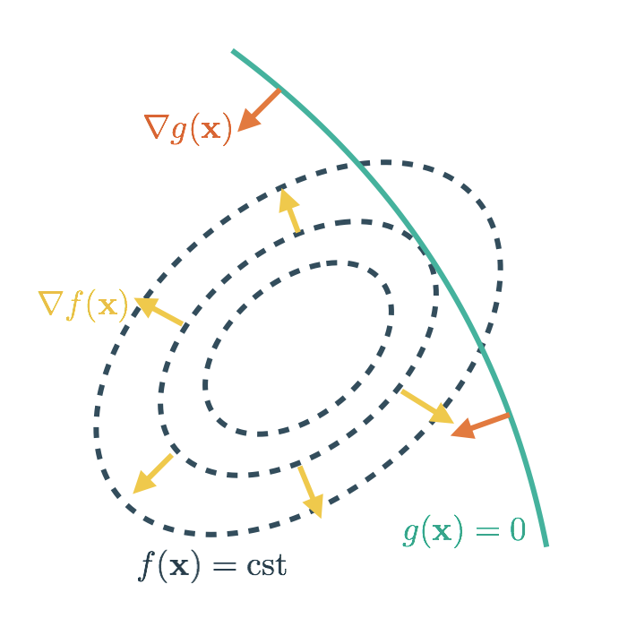
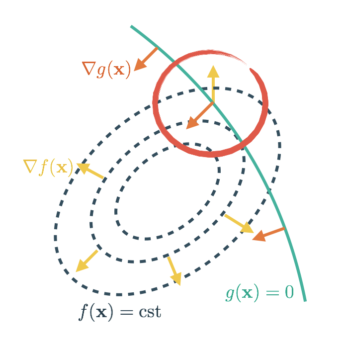
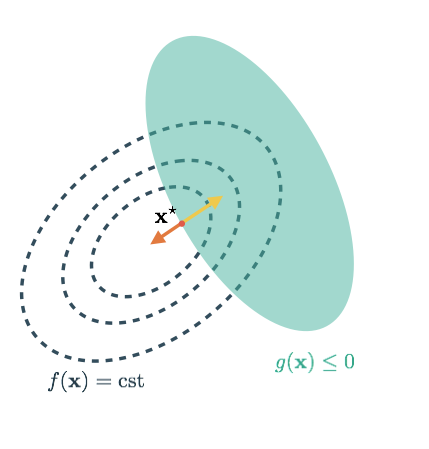

# Constrained convex optimization

*Selected Topics in Mathematical Optimization: 2017-2018*

**Michiel Stock** ([email](michiel.stock@ugent.be))


## Motivation

## Lagrange multipliers

Lagrange multipliers are elegant ways of finding stationary points of a function of several variables given one or more constraints. We give a short introduction from a geometric perspective.

### Equality constraints

Consider the following optimization problem:

$$
\min_{\mathbf{x}} f(\mathbf{x})\\
\text{subject to } g(\mathbf{x})=0\,.
$$


For every point $\mathbf{x}$ on the surface $g(\mathbf{x})$, the gradient $\nabla g(\mathbf{x})=0$. This can be shown by considering a point $\mathbf{x}+\boldsymbol{\epsilon}$, also on the surface. If we make a Taylor expansion around $\mathbf{x}$, we have
$$
g(\mathbf{x}+\boldsymbol{\epsilon})\approx g(\mathbf{x}) + \boldsymbol{\epsilon}^\top\nabla g(\mathbf{x})\,.
$$



Given that both $\mathbf{x}$ and $\mathbf{x}+\boldsymbol{\epsilon}$ lie on the surface it follows that $g(\mathbf{x}+\boldsymbol{\epsilon})= g(\mathbf{x})$. In the limit that $||\boldsymbol{\epsilon}||\rightarrow 0$ we have that $\boldsymbol{\epsilon}^\top\nabla g(\mathbf{x})=0$. Because $\boldsymbol{\epsilon}$ is parallel to the surface $g(\mathbf{x})$, it follows that $\nabla g(\mathbf{x})$ is normal to the surface.

We seek a point $\mathbf{x}^\star$ on the surface such that $f(\mathbf{x})$ is minimized. For such a point, it should hold that the gradient w.r.t. $f$ should be parallel to $\nabla g$. Otherwise, it would be possible to give a small 'nudge' to $\mathbf{x}^\star$ in the direction of $\nabla f$ to decrease the function value, which would indicate that $\mathbf{x}^\star$ is not a minimizer. This figures below illustrate this point.




$$
\nabla f(\mathbf{x}^\star) + \nu \nabla g (\mathbf{x}^\star)=0\,,
$$
with $\nu\neq 0$ called the *Lagrange multiplier*. The constrained minimization problem can also be represented by a *Lagrangian*:
$$
L(\mathbf{x}, \nu) 	\equiv f(\mathbf{x}) + \nu g(\mathbf{x})\,.
$$
The constrained stationary cndition is obtained by setting $\nabla_\mathbf{x} L(\mathbf{x}, \nu) =0$, the condition $\partial  L(\mathbf{x}, \nu)/\partial \nu=0$ leads to the constraint equation $g(\mathbf{x})=0$.

### Inequality constraints

The same argument can be made for inequality constraints, i.e. solving

$$
\min_{\mathbf{x}} f(\mathbf{x})\\
\text{subject to } g(\mathbf{x})\leq0\,.
$$

Here, two situations can arise:

- **Active constraint**: the minimizer of $f$ lies in the region where $g(\mathbf{x}) > 0$. The solution of the constrained problem will lie on the bound where $g(\mathbf{x})=0$, similar to the equality-constrained problem and corresponds to a Lagrange multiplier $\nu>0$.
- **Inactive constrained**: the minimizer of $f$ lies in the region where $g(\mathbf{x}) < 0$. This corresponds to a Lagrange multiplier $\nu=0$. Note that the solution would be the same if the constraint was not present.

Both scenarios are shown below:




For both cases, the product $\nu g(\mathbf{x})=0$, the solution should thus satisfy the following conditions:
$$
g(\mathbf{x}) \geq 0
$$
$$
\nu \geq 0
$$
$$
\nu g(\mathbf{x})=0\,.
$$
These are called the *Karush-Kuhn-Tucker* conditions.

It is relatively straightforward to extend this framework towards multiple constraints (equality and inequality) by using several Lagrange multipliers.

TODO: Check this!

## Equality constrained convex optimization

We will start with convex optimization problems with linear equality constraints:

$$
\min_\mathbf{x} f(\mathbf{x}) \\
\text{subject to } A\mathbf{x}=\mathbf{b}
$$

where $f : \mathbb{R}^n \rightarrow \mathbb{R}$ is convex and twice continuously differentiable and $A\in \mathbb{R}^{p\times n}$ with a rank $p < n$.

TODO: link with Lagrange multipliers

A point $\mathbf{x}^\star\in$ **dom** $f$ is optimal for the above optimization problem only if there is a $\boldsymbol{\nu}\in\mathbb{R}^p$ such that:

$$
A\mathbf{x}^\star = \mathbf{b}, \qquad \nabla f(\mathbf{x}^\star) + A^\top\boldsymbol{\nu}^\star = 0\,.
$$

We will reuse the same toy examples from the previous chapter, but add an equality constraint to both.

- Simple quadratic problem:

$$
 f(x_1, x_2)  = \frac{1}{2} (x_1^2 + 4 x_2^2)\\
 \text{subject to }  x_1 - 2x_2 = 3
$$

- A non-quadratic function:

$$
f(x_1, x_2)   = \log(e^{x_1 +3x_2-0.1}+e^{x_1 -3x_2-0.1}+e^{-x_1 -0.1})\\
 \text{subject to }  x_1 + 3x_2 = 0  
$$


### Equality constrained convex quadratic optimization

Consider the following equality constrained convex optimization problem:

$$
\min\frac{1}{2}\mathbf{x}^\top P \mathbf{x} + \mathbf{q}^\top \mathbf{x} + r  \\
\text{subject to }  A\mathbf{x}=\mathbf{b}
$$

where $P$ is positive definite.

The optimality conditions are
$$
A\mathbf{x}^\star = \mathbf{b}, \quad P\mathbf{x}^\star+\mathbf{q} +A^\top\boldsymbol{\nu}^\star=\mathbf{0}\,,
$$
which we can write as

$$
\begin{bmatrix}
P & A^\top \\
A & 0 \\
     \end{bmatrix}
     \begin{bmatrix}
\mathbf{x}^\star\\
\boldsymbol{\nu}^\star
     \end{bmatrix}
     =
     \begin{bmatrix}
-\mathbf{q} \\
\mathbf{b}
     \end{bmatrix}
$$

```python
def solve_constrained_quadratic_problem(P, q, A, b):
    """
    Solve a linear constrained quadratic convex problem.

    Inputs:
        - P, q: quadratic and linear parameters of
                the linear function to be minimized
        - A, b: system of the linear constraints
        -
    Outputs:
        - xstar: the exact minimizer
        - vstar: the optimal Lagrange multipliers
    """
    p, n = A.shape  # size of the problem
    # complete this code
    # HINT: use np.linalg.solve and np.bmat
    solution = ...
    xstar = solution[:n]
    vstar = solution[n:]
    return np.array(xstar), np.array(vstar)
```
### Eliminating equality constraints

### Newton's method with equality constraints

To derive $\Delta \mathbf{x}_{nt}$ for the following equality constrained problem

$$
\min  f(\mathbf{x}) \\
\text{subject to }  A\mathbf{x}=\mathbf{b}
$$

we apply a second-order Taylor approximation at the point $\mathbf{x}$, to obtain

$$
\min \hat{f}(\mathbf{x} +\mathbf{v}) = f(\mathbf{x}) +\nabla f(\mathbf{x})^\top \mathbf{v}+ (1/2)\mathbf{v}^\top \nabla^2 f(\mathbf{x}) \mathbf{v} \\
\text{subject to } A(\mathbf{x}+\mathbf{v})=\mathbf{b}\,.
$$

Based on the solution of quadratic convex problems with linear contrains, the Newton $\Delta \mathbf{x}_{nt}$ step is characterized by

$$
\begin{bmatrix}
 \nabla^2 f(\mathbf{x})&  A^\top \\
A & 0 \\
     \end{bmatrix}
     \begin{bmatrix}
\Delta x_{nt}\\
\mathbf{w}
     \end{bmatrix}
     =
     -\begin{bmatrix}
\nabla f(\mathbf{x}) \\
A\mathbf{x}-\mathbf{b}
     \end{bmatrix}
$$

Note that when we start at a feasible point, the residual vector $-(A\mathbf{x}-\mathbf{b})$ vanishes and the path will always remain in a feasible region. Otherwise we will converge to it.

In this chapter, we will use a fixed step size. For Newton's method this usually leads to only a few extra iterations compared to an adaptive step size.

>**input** starting point $x\in$ **dom** $f$ with $A\mathbf{x}=\mathbf{b}$, tolerance $\epsilon>0$.
>
>**repeat**
>
>>    1. Compute the Newton step $\Delta \mathbf{x}_{nt}$ and decrement $\lambda(\mathbf{x})$.
>>    2. *Stopping criterion*. **quit** if $\lambda^2/2\leq \epsilon$.
>>    3. *Choose step size $t$*: either by line search or fixed $t$.
>>    4. *Update*. $\mathbf{x}:=\mathbf{x}+t \Delta \mathbf{x}_{nt}$.
>
>**until** stopping criterium is satisfied.
>
>**output** $\mathbf{x}$

Again, the convergence can be monitored using the Newton decrement:

$$
\lambda^2(\mathbf{x}) = - \Delta \mathbf{x}_{nt}^\top \nabla f(\mathbf{x})\,.
$$

The algorithm terminates when

$$
\frac{\lambda(\mathbf{x})^2}{2} < \epsilon\,.
$$

```python
def linear_constrained_newton(f, x0, grad_f,
              hess_f, A, b, stepsize=0.25, epsilon=1e-3,
              trace=False):
    '''
    Newton's method for minimizing functions with linear constraints.

    Inputs:
        - f: function to be minimized
        - x0: starting point (does not have to be feasible)
        - grad_f: gradient of the function to be minimized
        - hess_f: hessian matrix of the function to be minimized
        - A, b: linear constraints
        - stepsize: step size for each Newton step (fixed)
        - epsilon: parameter to determine if the algorithm is converged
        - trace: (bool) store the path that is followed?

    Outputs:
        - xstar: the found minimum
        - x_steps: path in the domain that is followed (if trace=True)
        - f_steps: image of x_steps (if trace=True)
    '''
    assert stepsize < 1 and stepsize > 0
    x = x0  # initial value
    p, n = A.shape
    if trace: x_steps = [x.copy()]
    if trace: f_steps = [f(x0)]
    while True:
        ddfx = hess_f(x)
        dfx = grad_f(x)
        # calculate residual
        Dx, _ = solve_constrained_quadratic_problem(... # complete!
        newton_decrement = ...
        if newton_decrement < epsilon:  # stopping criterion
            break  # converged
        x += stepsize * Dx
        if trace: x_steps.append(x.copy())
        if trace: f_steps.append(f(x))
    if trace: return x, x_steps, f_steps    
    else: return x
```

## Inequality constrained convex optimization

### Inequality constrained minimization problems

### Logarithmic barrier and the central path

### The barrier method

## Exercise:
