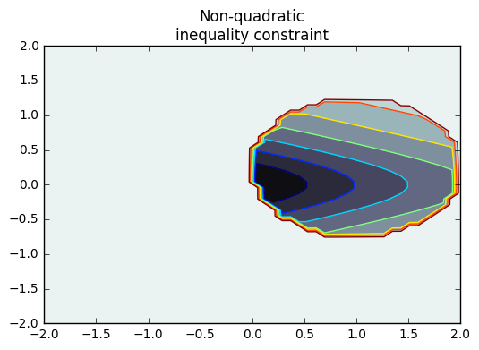

# Constrained convex optimization (2)

*Selected Topics in Mathematical Optimization: 2017-2018*

**Michiel Stock** ([email](michiel.stock@ugent.be))

## Inequality constrained convex optimization

### Inequality constrained minimization problems

$$
\min_\mathbf{x}  f_0(\mathbf{x})\\
\text{subject to } f_i(\mathbf{x}) \leq 0, \quad i=1,\ldots,m\\
A\mathbf{x}=\mathbf{b}
$$
where $f_0,\ldots,f_m\ :\ \mathbb{R}^n \rightarrow \mathbb{R}$ are convex and twice continuously differentiable, and $A\in \mathbb{R}^{p\times n}$ with **rank** $A=p<n$.

**Question 1**

Write the inequality constraints for the case when:

1. $x_k\geq 0$
2. $\mathbf{x}$ lies in the unit sphere.

Using the theory of Lagrange multipliers, a point $\mathbf{x}^\star \in\mathbb{R}^n$ is optimal if and only if there exist a $\boldsymbol{\lambda}^\star\in \mathbb{R}^m$ and $\boldsymbol{\nu}^\star\in \mathbb{R}^p$ such that
$$
A\mathbf{x}^\star=\mathbf{b}
$$
$$
f_i(\mathbf{x}^\star) \leq 0, \quad i=1,\ldots,m
$$
and
$$
\lambda_i \geq 0
$$
$$
\nabla f_0(\mathbf{x}^\star)+\sum_{i=1}^m\lambda_i\nabla f_i(\mathbf{x}^\star) +A^\top \boldsymbol{\nu}^\star=0
$$
$$
\lambda_if_i(\mathbf{x}^\star)=0, \quad i=1,\ldots,m\,.
$$

**Example**

The non-quadratic function with inequality constraints:

$$
f(x_1, x_2)   = \log(e^{x_1 +3x_2-0.1}+e^{x_1 -3x_2-0.1}+e^{-x_1 -0.1})
$$
$$
 \text{subject to }  (x_1 - 1)^2 + (x_2 - 0.25)^2 - 1\leq 0
$$

### Implicit constraints

Rather than solving a minimization problems with inequality constraints, we can reformulate the objective function to include only the feasible regions:

$$
\min_{\mathbf{x}} f_0(\mathbf{x})+\sum_{i=1}^m I_{-}(f_i(\mathbf{x}))
$$
$$
A\mathbf{x}=\mathbf{b}
$$
where $I_{-}:\mathbb{R}\rightarrow \mathbb{R}$ is the *indicator function* for the nonpositive reals:
$$
I(u) = 0 \text{ if } u\leq 0
$$
and
$$
I(u) = \infty \text{ if } u> 0\,.
$$
Sadly, we cannot directly optimize such a function using gradient-based optimization as $I$ does not provide gradients to guide us.

### Logarithmic barrier

Main idea: approximate $I_-$ by the function:

$$
\hat{I}_-(u) = - (1/t)\log(-u) \text{ if } u< 0
$$
and
$$
\hat{I}_-(u)=\infty  \text{ if } u\geq 0
$$
where $t>0$ is a parameter that sets the accuracy of the approximation.

Thus the problem can be approximated by:

$$
\min_\mathbf{x} f_0(\mathbf{x}) +\sum_{i=1}^m-\hat{I}_-(f_i(\mathbf{x})
$$
$$
\text{subject to } A\mathbf{x}=\mathbf{b}\,.
$$
Note that:

- since $\hat{I}_-(u)$ is convex and  increasing in $u$, the objective is also convex
- unlike the function $I$, the function $\hat{I}_-(u)$ is differentiable
- as $t$ increases, the approximation becomes more accurate, as shown below

### The barrier method

The function

$$
\phi (\mathbf{x}) =\sum_{i=1}^m-\log(-f_i(\mathbf{x}))\,
$$

is called the **logarithmic barrier** for the constrained optimization problem.

The new optimization problem becomes:
$$
\min_\mathbf{x} tf_0(\mathbf{x}) +\phi (\mathbf{x})
$$
$$
\text{subject to } A\mathbf{x}=\mathbf{b}\,.
$$

- The parameter $t$ determines the quality of the approximation, the higher the value the closer the approximation matches the original problem.
- The drawback of higher values of $t$ is that the problem becomes harder to optimize using Newton's method, as its Hessian will vary rapidly near the boundary of the feasible set.
- This can be circumvented by solving a sequence of problems with increasing $t$ at each step, starting each Newton minimization at the solution of the previous value of $t$.

Computed for you:

- gradient of $\phi$:
$$
\nabla\phi(\mathbf{x}) = \sum_{i=1}^m\frac{1}{-f_i(\mathbf{x})} \nabla f_i(\mathbf{x})
$$
- Hessian of $\phi$:
$$
\nabla^2\phi(\mathbf{x}) = \sum_{i=1}^m \frac{1}{f_i(\mathbf{x})^2} \nabla f_i(\mathbf{x}) \nabla f_i(\mathbf{x})^\top+\sum_{i=1}^m\frac{1}{-f_i(\mathbf{x})^2} \nabla^2 f_i(\mathbf{x})
$$

The pseudocode of the barrier method is given below. We start with a low value of $t$ and increase every step with a factor $\mu$ until $m/t$ is smaller than some $\epsilon>0$.

>**input** strictly feasible $\mathbf{x}$, $t:=t^{(0)}>0, \mu>1$, $t_\text{max}$, tolerance $\epsilon>0$.
>
>**repeat**
>
>>    1. *Centering step*. 
>>   Compute $\mathbf{x}^*(t)$ by minimizing $tf_0+\phi$, subject to $A\mathbf{x}=\mathbf{b}$, starting at $\mathbf{x}$.
>>    2. *Update*. $\mathbf{x}:=\mathbf{x}^*(t)$
>>    3. *Increase* $t$. $t:=\mu t$.
>
>**until** $m/t < \epsilon$
>
>**output** $\mathbf{x}$

**Choice of $\mu$**

The choice has a trade-off in the number of inner and outer iterations required:
- If $\mu$ is small (close to 1) then $t$ increases slowly. A large number of Newton iterations will be required, but each will go fast.
- If $\mu$ is large then $t$ increases very fast. Each Newton step will take a long time to converge, but few iterations will be needed.

The exact value of $\mu$ is not particularly critical, values between 10 and 20 work well.

**Choice of $t^{(0)}$**

- If $t^{(0)}$ is chosen too large: the first outer iteration will require many iterations.
- If $t^{(0)}$ is chosen too small: the algorithm will require extra outer iterations.

### Central path

The *central path* is the set of points satisfying:

- $\mathbf{x}^\star(t)$ is strictly feasible: $A\mathbf{x}^\star(t)=\mathbf{b}$ and $f_i(\mathbf{x}^\star(t))<0$ for $i=1,\ldots,m$
- there exist $\hat{\boldsymbol{\nu}}\in\mathbb{R}^p$ such that
$$
t\nabla f_0(\mathbf{x}^\star(t)) + \nabla \phi(\mathbf{x}^\star(t)) +A^\top \hat{\boldsymbol{\nu}}=0
$$
- one can show that $f_0(\mathbf{x}^\star(t))-p^\star\leq m / t$: $f_0(\mathbf{x}^\star(t))$ converges to an optimal point as $t\rightarrow \infty$.
